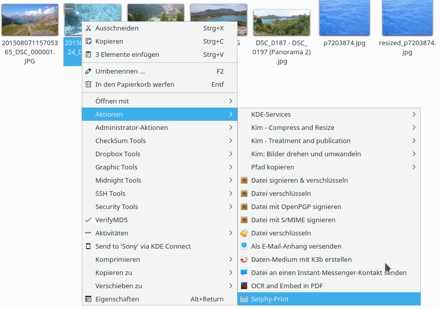

# canon-selphy-print
Suport for Canon SELPHY CP1200, CP1300 and other compatible printers.

## Installation
1. Copy print-selphy.desktop to ~/.local/share/kservices5/ServiceMenus
1. Copy print-selphy to any place (eg. ~/Scripts/)
1. Make sure print-selphy is executable
1. Adjust path to print-selphy in print-selphy.desktop
1. Open a new instance of dolphin and select the print-selphy action in an images contex menu: 

## Known issues
- Multiple files selection not working
- Only tested with postcard mode
